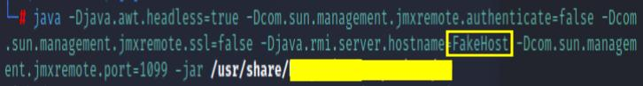

# SimpleRmiDiscoverer
Simple JMX RMI scanning tool 

The tool offers the following options for exposed Java JMX:
- Extracting JMX endpoint (IP/Name and TCP port) from RMI Registry (with -d, --dumponly)
- Checking over IP/Name and TCP port extracted from the above RMI Registry if JMX objects are user/password protected
- Checking over the RMI Registry IP/Name itself and the TCP port extracted from the above RMI Registry if JMX is user/password protected (with -i, --ignore) and ignoring IP/Name extracted from the RMI Registry

## Prerequisites
* [Apache Commons] (https://commons.apache.org/) (for cmd arguments parsing)

$ java -cp ".:commons-cli-1.5.0/commons-cli-1.5.0.jar" SimpleRmiDiscoverer.java -H 1.1.1.1 -P 1099 -i --help

## Usage

SimpleRmiDiscoverer [-d] [-h] -H RMI-HOST-IP [-i] -P RMI-HOST-TCP-PORT

SimpleRmiDiscoverer extracts JMX host:port endpoint from RMI registry and checks if is exploitable using management applet (MLet) without credentials.

Where:

* **-d,--dumponly**                    Extracting endpoint <host:port> from RMI Registry without checking JMX exploitabilty without credentials.
 
* **-h,--help**                        Prints help for the tool.
 
* **-H,--host**                        IP of RMI Registry to query.

* **-i,--ignore**                      Uses RMI registry IP for methods invocations. Ignores endpoint (IP) from the Registry dump.

* **-P,--port**                        TCP port of RMI Registry to query.
 
## Examples of Use:

Consider the JVM applet running with the following properties:

Dumping RMI registry (-d, --dumponly) option gives the following result:

Checking if the host (192.168.229.131) is vulnerable requires in this case using option -i, --ignore.
It helps ignoring "FakeHost" and using 192.168.229.131 instead together with the dynamic TCP port
(45057) extracted earlier from RMI Registry:

Please check my Blog for more details: https://marcin-wolak.medium.com/
